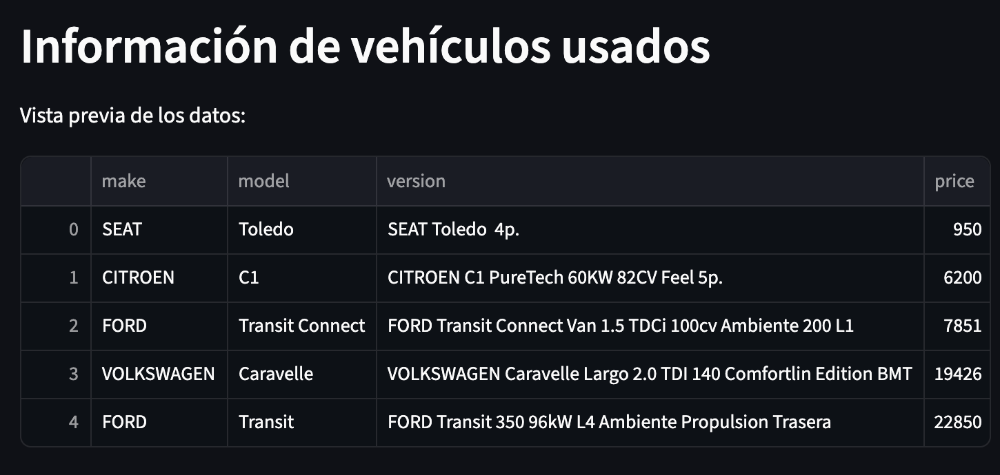
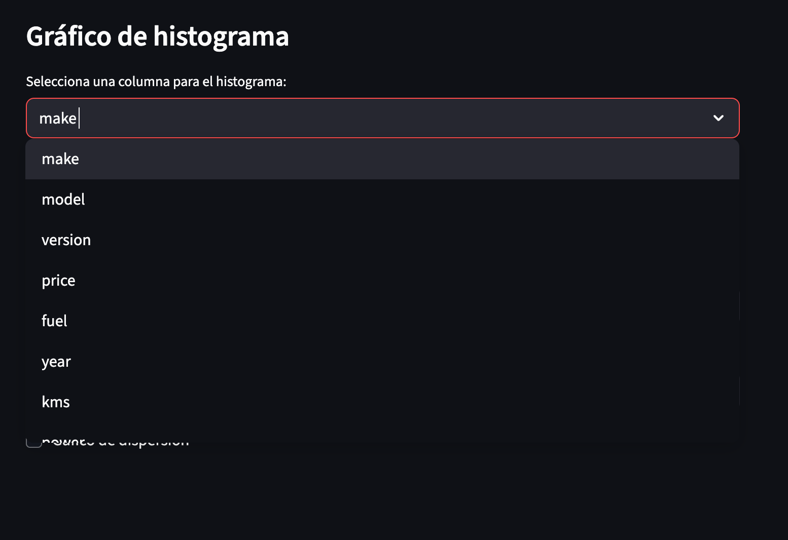
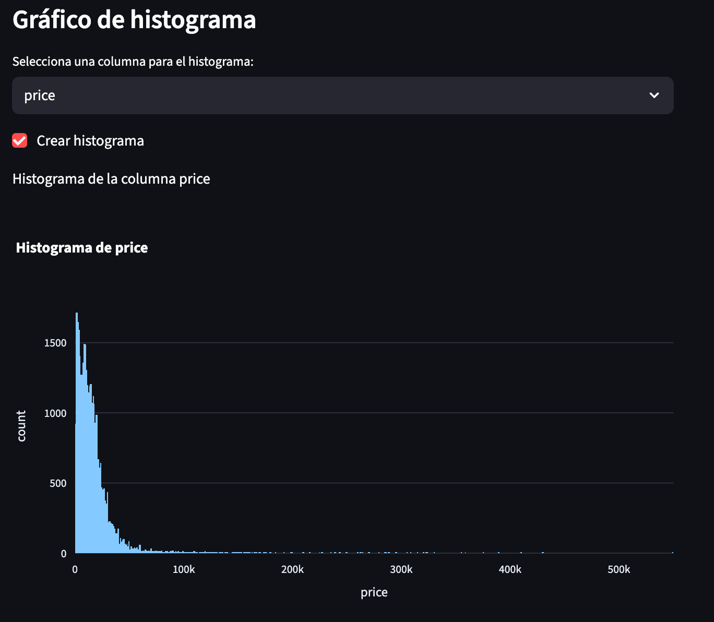
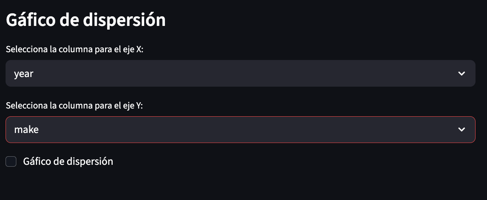
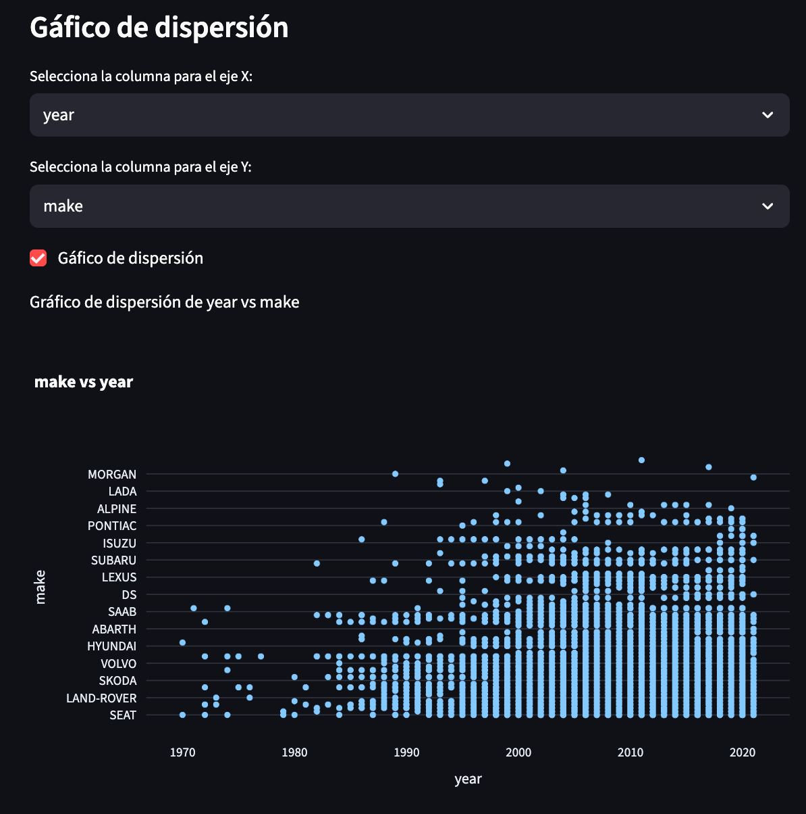

# vehicles_env
Esta aplicación utiliza una base de datos de autos usados con sus respectivas características, datos que el usuario podrá visualizar a su gusto con el despliegue de casillas estilo selectbox que le permitirán filtrar el contenido de la base de datos y crear histogramas o gráficos de dispersión.

La aplicación primero muestra un tíeulo llamado "Información de vehículos usados", para inmediatamente mostrar una vista previa del contenido del dataset.

Posteriormente, se muestra al usuario un selectbox donde podrá elegir el tipo de columna que quiere utilizar para realizar un histograma.  

Para visualizar su gráfico podrá dar clic en la casilla que indica "Crear histograma"

Así también, podrá repetir el mismo proceso, pero ahora en dos cuadros de tipo selectbox.

Si el usuario desea visualizar el gráfico de dispersión, creado a partir de las columnas que seleccionó previamente, podrá dar clic en la casilla que indica "Gráfico de dispersión."

En el presente proyecto obtuve el dataset del siguiente enlace:
https://github.com/Data-Market/vehiculos-de-segunda-mano/blob/main/coches-de-segunda-mano-sample.csv

El proyecto puede visualizarse desplegado en el siguiente enlace de la plataforma render:

Desarrolaldor:

Gerardo Parada Cornejo